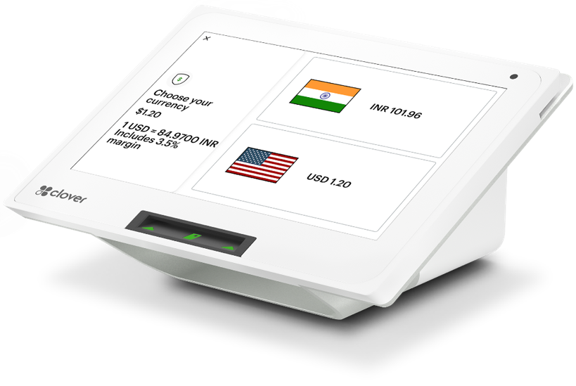

## Dynamic Currency Conversion

Dynamic Currency Conversion (DCC) is a Card Present (CP) and Card Not Present (CNP) offering that allows merchants to offer international credit cardholders the choice to pay in either their own currency or the merchant’s base currency. Merchants benefit by offering their foreign customers the choice, convenience, and transparency to pay in their card billing. This service is offered for Visa and Mastercard credit transactions and  for more than 70 global Visa and Mastercard-supported currencies.

The DCC choice is determined by interrogating the BIN of the card to determine whether the card is eligible for conversion. If determined to be eligible, disclosures must be presented to the cardholder to allow them to make an active choice to pay in their card billing currency or the merchant’s local currency (for US merchant, USD). The card associations mandate rules for offering DCC to protect the cardholder and merchants. The fundamental principles of DCC are:

1. <b>Cardholder Choice:</b> The DCC merchant must offer the cardholder a choice to transact in the merchant’s local currency or in their card billing currency
1. <b>Transparency & Disclosure:</b> For a cardholder to make an informed choice, merchants must disclose all charges associated with DCC. DCC disclosures must occur at the time the DCC offer is made and before the cardholder is asked to actively choose the transaction currency.
1. <b>Steering:</b> The merchant must not use any language or procedures that may cause the cardholder to choose DCC by default.

The card scheme-mandated disclosures, include:

- Amount of the goods or services (including taxes) shown in the merchant’s local currency
- Currency symbol or code (e.g., AUD or SGD) of the merchant’s local currency
- Exchange rate used to determine the DCC transaction amount
- Any additional exchange rate mark-up over the wholesale or government-mandated rate
- Total transaction amount in the DCC currency
- Currency symbol or code (e.g., AUD or SGD) of the offered DCC transaction amount in cardholder currency

## APIs Used
<!-- type: row -->
<!-- type: card 
title: Get Rate
description: 
link: ../api/?type=post&path=/fx/v1/pricing/request
-->

<!-- type: card 
title: Get BINs by Currency
description: This API will provide the list of available BINs in OpenFX for the given currency code.
link: ../api/?type=GET&path=/fx/v1/pricing/bin/{currency_code}
-->

<!-- type: row-end -->